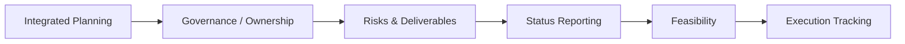

# Clinical Trial Study Operations Simulation

**Independent fictional portfolio simulation.** A connected demonstration of clinical project / study-operations planning, cross-functional coordination and execution tracking, from readiness dependencies to evidence-based follow-through.

## What I did

I developed an integrated timeline and milestone plan, analyzed dependencies, defined cross-functional responsibilities and governance, and built connected risk/issue/action/decision records. I also structured CRO/vendor deliverable coordination, weekly status reporting, enrollment/visit-capacity feasibility assessment and execution follow-through. The work distinguishes plans from actuals, delivery from acceptance, and assumptions from evidence.

## Study at a glance

| Dimension | Fictional study context |
|---|---|
| Study | SIM-001: Phase I first-in-human vaccine study |
| Participants | 36 |
| Sites | 4 fictional U.S. sites |
| Operating model | Sponsor-managed, with CRO support and a Central Lab |
| Scope | Study-operations / PM planning, integration, tracking and communication |

## PM workflow

## Start here

1. **[Execution Tracking Case Study](docs/execution-tracking-case-study.md)** - Planned versus actual tracking, operational exception follow-through, corrective-control verification, and reforecasting/impact assessment. One path follows canonical execution history; a separate alternative recovery exercise tests a missed administration and its downstream effects without changing that history. These are labeled Scenario B and Scenario C within the case study.
2. **[Weekly Status Report](docs/weekly-status-report.md)** - The **Apr 12, 2027 historical snapshot** demonstrates concise cross-functional reporting, separate health/evidence-confidence assessment and exception-focused communication.
3. **[Enrollment and Visit-Capacity Assessment](docs/enrollment-visit-capacity-assessment.md)** - Tests conditional feasibility and dependency implications across four sites without inventing unsupported capacity.

## Complete artifact index

| Capability demonstrated | Artifact |
|---|---|
| Integrated planning and milestone tracking | [Integrated Study Timeline](docs/integrated-study-timeline.md) |
| Cross-functional coordination / authority boundaries | [RACI + Governance](docs/raci-governance.md) |
| Risk / issue / action / decision tracking | [RAID Log](docs/raid-log.md) |
| CRO/vendor deliverable coordination | [Vendor Deliverables Tracker](docs/vendor-deliverables-tracker.md) |
| Status reporting | [Weekly Status Report](docs/weekly-status-report.md) |
| Enrollment / visit-capacity feasibility | [Capacity Assessment](docs/enrollment-visit-capacity-assessment.md) |
| Execution follow-through | [Execution Tracking Case Study](docs/execution-tracking-case-study.md) |

## Scenario and chronology

The connected scenario follows a Lab-readiness delay through milestone dependencies, an enrollment-capacity recovery plan and later execution follow-up.

- **Planning foundation:** [Study assumptions and original canonical baseline](docs/study-assumptions.md), published unchanged from the source used to build the simulation. Its setup-stage scope statements and earlier forecasts are historical. Approved later timing amendments are documented in the [deliverables tracker](docs/vendor-deliverables-tracker.md#approved-fictional-final-lab-sequence) and reflected in the timeline/RAID records.
- **Apr 12, 2027:** Preserved historical weekly-report snapshot; unavailable historical comparisons remain explicit.
- **Through Apr 23, 2027:** Canonical execution evidence in the case study and directly affected timeline/RAID records; advancing time does not automatically complete other activities.
- **Alternative exercise:** Separately labeled rescheduling and impact assessment, including limited fictional clinical clarifications applicable only to that branch.

Portfolio Steps 1-9 are complete. This means the artifacts are complete, not that the simulated study or all its actions are closed.

## Assumptions and boundaries

All study organizations, sites, dates and execution evidence are fictional. Clinical decisions remain with the appropriate fictional Investigator and clinical functions. My demonstrated contribution is PM planning, integration, dependency management, tracking, communication and follow-through. This project does **not** represent professional CTM experience or clinical decision authority.
